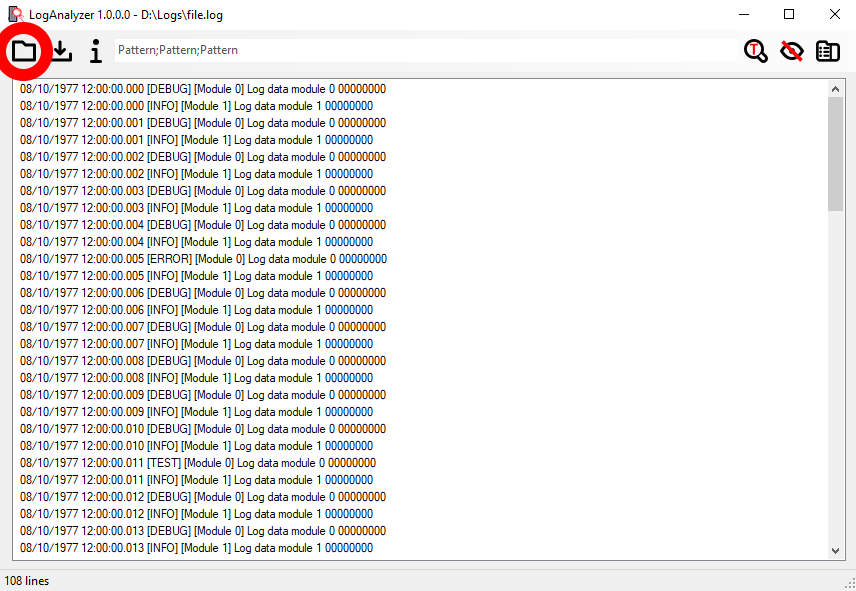
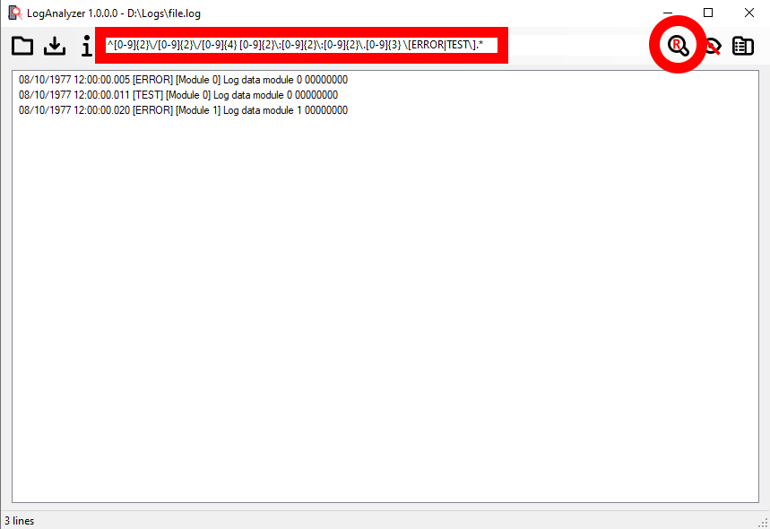
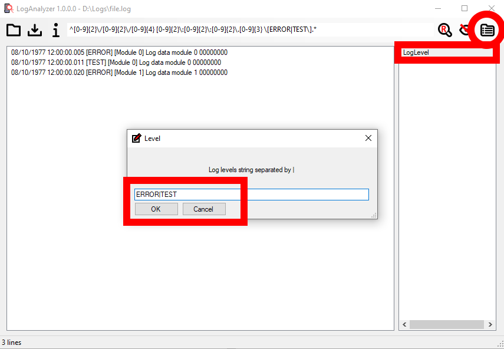
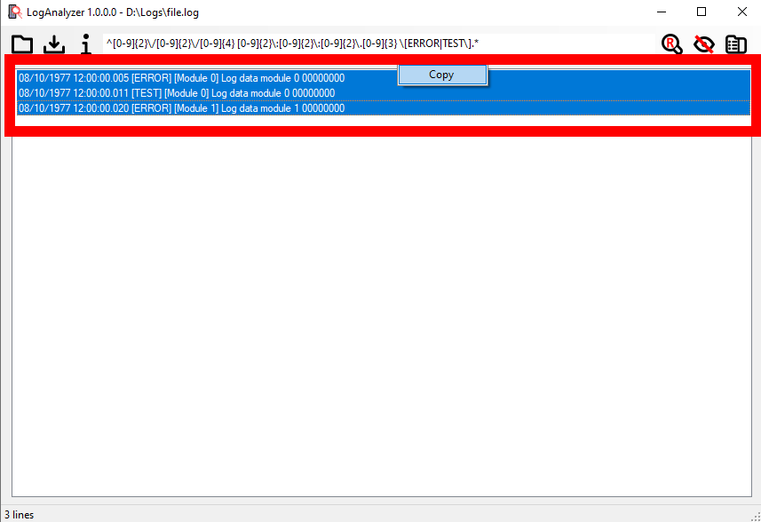
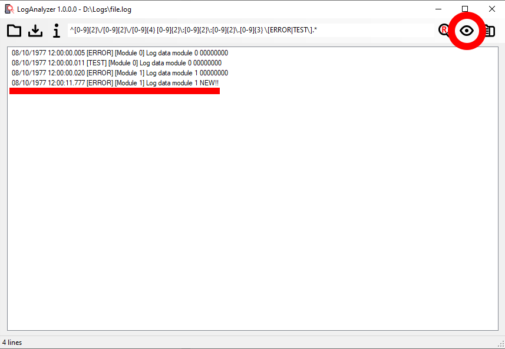
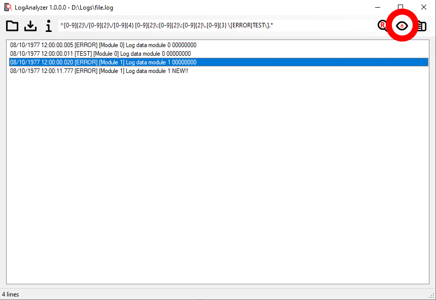

# LogAnalyzer

The smart text log analyzer you have ever dream!

## Preface

From my first experience as firmware engineer more than 20 years ago, I needed to analyze and filter many text file contains data in order to understand what was happened.
Under Linux environment `tail`, `grep`are basic powerful tools enough for me, but under Windows? You can get same tools, but when a Technical assistance engineer or Electrician need use them, `tail` and `grep` are little too much!
  
So I started to search a window tool that do what tail and grep do but I can't find!

So, I start to write some tools in many different languages from Visual Basic 6 to MFC and first version of .NET (1.1) making many experiences, and now last version in C# and .NET 4.6.

## Functionality

- Multi-threading architecture
- Open log file by icon menu or by drag and drop
- Open large log file (Tested until 1Gbyte and it works if your PC han enough memory) 
- Filter by "semicolon separated" text pattern
- Filter by regular expression match
- Ability to create a editable, user friendly regular expression filter pattern table
- Copy to clipboard selected lines
- Smart real-time follow (as ``tail -f`)

## Open log file

Open file by clicking on folder icon or by dragging and dropping file



## Text filtering

Selecting `Text` filter lines by semicolon separated text pattern


## Regex filtering

Selecting `Regex` filter lines by regular expression match



## Regex filter pattern table

With pattern table is possible to provide "user friendly" predefined list of configurable regular expression filters



### Regex filter pattern struct

Filter pattern table is described in `LogAnalyzerPattern.ini` where every section is a filter.

```
[LogLevel]
Description="Log level regex macro:\r\nto filter specific log level verifying values with regular expression"
Regex="^[0-9]{2}\/[0-9]{2}\/[0-9]{4} [0-9]{2}\:[0-9]{2}\:[0-9]{2}\.[0-9]{3} \[{Level}\].*"
Level="Log levels string separated by |;^([A-Z]{0,})$|^([A-Z]{0,}\|)*([A-Z]{0,})$"
```

- **\[SectionName\]**
	+ Is a unique identifier of the filter
- **Description**
	+ Is the description of what filter can do and appear in a tool-tip
- **RegEx**
	+ Is parametric regular expression where variables are identified by `{Variable}` pattern
- **Variable**
	+ For each variable inside Regex key, describe variable usage and input validation regular expression separated by semicolon. Input validation regular expression is optional. Last but not least, variable can't have name `RegEx` and `Description`.


## Copy selected lines

Select desired lines, right click and copy!



## Smart real-time follow

If log file is updated real-time from another process, enable `Follow` to get new data filtered ad desired.



If you select a specific line(s), follow temporary lock the scrolling until user press `End key` or `Esc key` or scroll until the end of log




		
